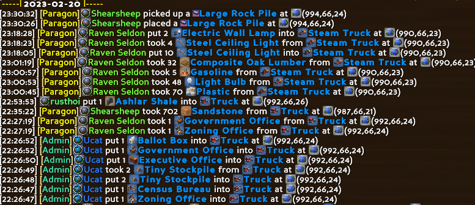
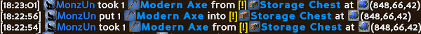
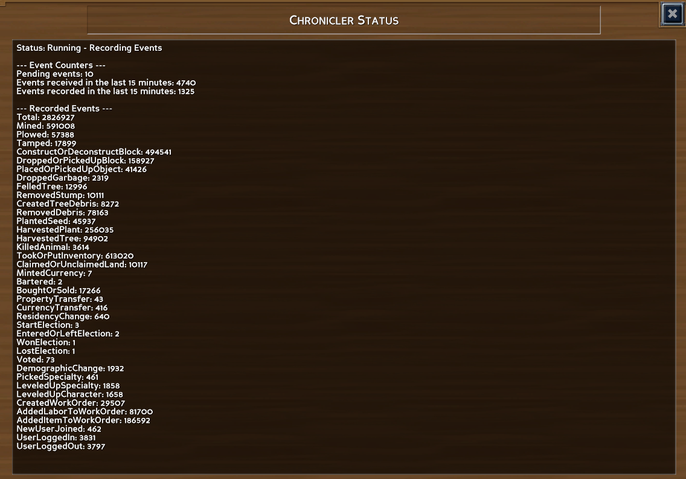

# Features

*   Records and look up many relevant game actions to enfore server rules, clear up confusion and bust griefers.
*   Players only have access to their own events wile admins can access everything.
*   Low performance impact in terms of both CPU and RAM.
*   Low disk space usage. Around 300 MB for a regular cycle and around 1gb for a high intensity server such as White Tiger.

# Installation

*   Unzip the archive into the server root directory (where the .exe is). This will place all the files in their place automatically.
*   Ensure that C++ redistributables 2012 are installed.

# Configuration

There are two ways to configure Chronicler.

1.  Use the server GUI to configure to change the config parameters found under the `Chronicler` tab.
2.  Copy the `Chronicler.eco.Template` file in `/Configs` and rename it `Chronicler.eco` and change the config parameters in that file.

## Configuration Parameters

| **Name**                   | **Possible Values**                                      | **Default Value**         | **Description**                                                                                                                            |
|----------------------------|----------------------------------------------------------|---------------------------|--------------------------------------------------------------------------------------------------------------------------------------------|
| RecordEvents               | True/False                                               | True                      | Determines whether or not game events should be recorded.                                                                                  |
| PerformanceCounterInterval | Positive non decimal number                              | 15                        | Determines what interval (in minutes) to use for the performance counters in the status displays.                                          |
| LogLevel                   | DebugVerbose, Debug, Warning, Information, Error, Silent | Information               | Determines what message types will be printed to the server log. All message types below the selected one will be printed as well.         |
| StorageDirectory           | Any valid path relative to the server executable.        | Storage\\Mods\\Chronicler | Determines the directory used for all file storage. The path is relative to the server root directory. Requires restart.                   |
| DatabaseName               | Any valid file name without extension.                   | Chronicle                 | Determines the name of the database file without extension. Requires restart.                                                              |

# Usage

Chronicler records actions as they are made in the game and the main way to interact with the plugin is via Commands. Players are only able to query commands pertaining to their own actions while admins have access to a wider array of quering commands.

See the [Commands List](Commands.md) for a full description of all available commands.

## Prefixes and Default Parameters

The list of commands is long, but they generally follow a repeating pattern of prefixes to make them easier to remember.

See the table below for an example of these prefixes and their default parameters.

| **Prefix**       | **Example**           | **Description**                                                        | **Required Parameters**    | **Default Parameters**          |
|------------------|-----------------------|------------------------------------------------------------------------|----------------------------|---------------------------------|
| No Prefix        | Trash                 | Queries all trash related events.                                      | None                       |   Page = 1                      |
| Location         | LocationTrash         | Queries all trash related events at and around the specified location. | X, Y, Z                    |   Page = 1                      |
| MyLocation       | MyLocationTrash       | Queries all trash related events at your current location.             | None                       |   Radius = 5, Page = 1          |
| User             | UserTrash             | Queries all trash related events involving the specified player.       | UserName or ID             |   Page = 1                      |
| My               | MyTrash               | Queries all trash related events involving you.                        | None                       |   Radius = 5, Page = 1          |

## **Pages**

The output window for queries is only able to display 200 entries. In order to get around this, Chronicler uses pages.

A page is simply a set of 200 events and it's always the last parameter for any query command and it defaults to 1, which means that you will always see the most recent events first.

## **Output Example**

## **Updates & Mod Compatibility**

The method by which Chronicler saves events relies on being able to identify an item, object, block etc using only one number.

A side effect of this is that if the set of items etc changes and offsets these ID numbers, Chronicler may show the wrong items when quering events made before the set of items was changed.

If this has happened, Chronicler will mark these events as "untrustworthy". Keep an eye out for the yellow exlamation mark visible in the image below to make sure that you do not act on erroneous information.

## **Status & Event Information**

Chronicler allows you to view both information about the state of the plugin, but also about events being sent to the server.

You can view this information by either opening the **Display** tab under the **Chronicler** tab in the server GUI, or by using the `Status` command ingame.

# **Contact**

If you are having issues or want to give feedback, please make a post in the **Eco World Mods** section of the [Modding Community Discord](https://discord.com/invite/pCkWfzQ).

# **Donations**

I develop and support the Eco World Mods and DiscordLink in my spare time.
If you find them useful, I'd greatly appreciate a small donation =)

